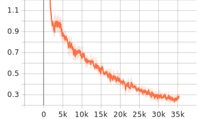

# hf-kws — Keyword Spotting with Hugging Face + PyTorch
> A compact, end‑to‑end pipeline for training, evaluating, and deploying a Wav2Vec2‑based keyword‑spotting (KWS) model. Includes realtime/streaming inference and one‑click AWS SageMaker deployment.
## Highlights
- **Train** a Hugging Face audio classifier (e.g., `facebook/wav2vec2-base`) for keyword spotting on **Speech Commands v2**.
- **Evaluate** with saved JSON metrics (train/val/test) and visualize **loss/F1** curves from `assets/`.
- **Infer** on single files or **stream from microphone**.
- **(Optional)** **Export to ONNX**.
- **Deploy** to **AWS SageMaker** (realtime, *serverless*, batch transform) + a small client to invoke the endpoint.
- **CI**: Ruff lint + PyTest, optional pipeline trigger.
## Repository Layout
```
hf-kws/
├── README.md
├── requirements.txt
├── src/
│   ├── data_utils.py
│   ├── augment.py
│   ├── utils.py
│   ├── train.py
│   ├── infer.py
│   ├── stream_infer.py
│   ├── evaluate.py
│   └── export_onnx.py
├── configs/
│   └── train_config.yaml
├── sagemaker/
│   ├── launch_training.py
│   ├── deploy_realtime.py
│   ├── deploy_serverless.py
│   ├── batch_transform.py
│   ├── pipeline.py
│   └── code/
│       ├── inference.py
│       └── requirements.txt
├── client/
│   ├── invoke_realtime.py
│   └── sample.jsonl
├── .github/workflows/ci.yml
├── Makefile
├── requirements.txt              
└── README_SageMaker.md
```
This project fine-tunes a Wav2Vec2 audio classifier for **keyword spotting** on the
open-source **Speech Commands v2** dataset, then runs both offline and realtime streaming inference.

## Features
- ✅ Fine-tune `Wav2Vec2` (or any HF audio classifier) with 🤗 `Trainer`
- ✅ Robust audio augmentations (time-shift, noise, random gain)
- ✅ Realtime streaming inference from microphone with sliding-window smoothing
- ✅ Offline file-based inference (single file or batch)
- ✅ Evaluation + confusion matrix
- ✅ (Optional) Export to ONNX for deployment

## Setup
```bash
cd hf-kws
python -m venv .venv && source .venv/bin/activate  # Windows: .venv\Scripts\activate
pip install --upgrade pip
pip install -r requirements.txt
```

## Train 
```bash
python -m src.train \
  --checkpoint facebook/wav2vec2-base \
  --output_dir ./checkpoints/kws_w2v2 \
  --num_train_epochs 8 \
  --per_device_train_batch_size 16 \
  --per_device_eval_batch_size 16

```
**Download** the finetuned weights with bellow hyperparameter from [here](https://drive.google.com/file/d/1Fi0re7HHcYu83alKxYUgk2zMMUSgaLiN/view?usp=sharing)

## 🚀 Training Command

To reproduce the default training run:

```bash
python train.py \
```
By default, the script uses the speech_commands dataset.


## 🖥️ Training Hardware & Environment

- **Device:** Laptop (Windows, WDDM driver model)
- **GPU:** NVIDIA GeForce **RTX 3080 Ti Laptop GPU** (16 GB VRAM)
- **Driver:** **576.52**
- **CUDA (driver):** **12.9**
- **PyTorch:** **2.8.0+cu129**
- **CUDA available:** ✅

---

## 📊 Training Logs & Metrics

- **Total FLOPs (training):** `7,703,275,221,221,900,000`
- **Training runtime:** `3,446.3047` seconds
- **Logging:** TensorBoard-compatible logs in `src/logs/training-logs/`

You can monitor training live with:

```bash
tensorboard --logdir src/logs/training-logs
```

### 📉 Loss Curve

The following plot shows the training loss progression:



*(SVG file generated during training and stored under `assets/`)*
## Inference 
```bash
python -m src.infer \
  --model_dir ./checkpoints/kws_w2v2 \
  --wav_path /path/to/your.wav \
  --top_k 5
```

## Evaluate on Test Set
```bash
python -m src.evaluate_fn --model_dir ./checkpoints/kws_w2v2
```


## AWS SageMaker — Train, Deploy, Batch

> This repository includes a minimal but complete SageMaker setup (scripts + client + CI).

### Prerequisites
- AWS account + `sagemaker` and `ecr` permissions.
- Set `AWS_REGION` and (if using GitHub Actions) `AWS_ROLE_TO_ASSUME` as repository variables/secrets.

### Quick commands (via `Makefile`)
```bash
# 1) Launch a training job
make train

# 2) Deploy a realtime endpoint
make deploy
# or deploy Serverless Inference
make deploy-sls

# 3) Run a Batch Transform job over a JSONL manifest in S3
make batch

# 4) Tear down the endpoint
make delete
```

### What the scripts do
- **`sagemaker/launch_training.py`** – spins up a Hugging Face training job. Region defaults to your session (`boto3.Session().region_name` or `us-east-1`). 
- **`sagemaker/deploy_realtime.py`** – creates a Hugging Face model and deploys a realtime endpoint; supports **Serverless Inference** when `SERVERLESS=true`.
- **`sagemaker/batch_transform.py`** – runs offline inference using a JSONL manifest in S3. Set env vars (examples):  
  `MODEL_S3` (model tarball), `INPUT_JSONL_S3` (JSONL path), `OUTPUT_S3` (optional), `BT_INSTANCES`, `BT_INSTANCE_TYPE`.  
  Each JSONL line looks like:  
  ```json
  {"inputs": {"s3_uri": "s3://bucket/key.wav"}, "parameters": {"top_k": 5}}
  ```
- **`sagemaker/code/inference.py`** – custom entrypoint for Hugging Face Inference Toolkit. **Accepted inputs** (any of):  
  - `{"inputs": {"base64": "<...>"}}` (WAV bytes)  
  - `{"inputs": {"s3_uri": "s3://..."}}`  
  - `{"inputs": {"url": "https://..."}}`  
  - `{"inputs": {"array": [...], "sampling_rate": 16000}}`  
  Returns top‑K labels/scores.
- **`client/invoke_realtime.py`** – tiny invoker:  
  ```bash
  AWS_REGION=us-east-1 ENDPOINT_NAME=kws-realtime WAV_PATH=sample.wav TOP_K=5   python client/invoke_realtime.py
  ```

### CI (GitHub Actions)
- Workflow: `.github/workflows/ci.yml` → checkout → set up Python 3.10 → install `requirements.txt` → run `ruff` and `pytest`.  
  On `main`, if `AWS_ROLE_TO_ASSUME` is set, it **configures AWS creds** and runs `python sagemaker/pipeline.py`.

---

## Tips & Troubleshooting
- Use `-h` on any script (e.g., `python -m src.train -h`) to see all flags.
- If you previously saw `requireeements.txt`, note it’s been **renamed** to `requirements.txt`.
- For realtime inference audio I/O issues, check microphone permissions and default input device.
- If CUDA mismatches occur, verify your driver/runtime pairing (example run used CUDA 12.9 with PyTorch 2.8.0+cu129).

---

## Roadmap
- Confusion matrix and per‑class metrics visualization.
- More keyword sets and multilingual support.
- Quantization / distillation + mobile demo (TFLite/CoreML).

## Acknowledgements
- Hugging Face `transformers` and `datasets`
- Google **Speech Commands** dataset